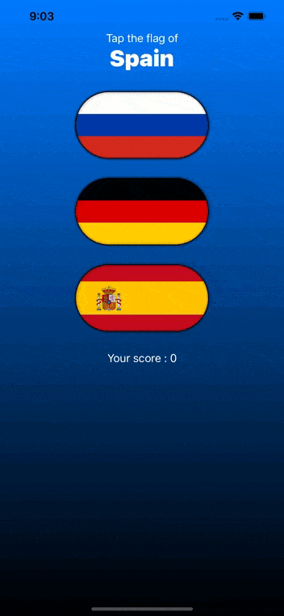

# Project 2 - GuessTheFlag

https://www.hackingwithswift.com/100/swiftui/20

## Topics

VStack, Image, Alert

## Challenges

From [Hacking with Swift](https://www.hackingwithswift.com/books/ios-swiftui/guess-the-flag-wrap-up):
>1. Add an @State property to store the user’s score, modify it when they get an answer right or wrong, then display it in the alert.
>2. Show the player’s current score in a label directly below the flags.
>3. When someone chooses the wrong flag, tell them their mistake in your alert message – something like “Wrong! That’s the flag of France,” for example.

## Screenshots

