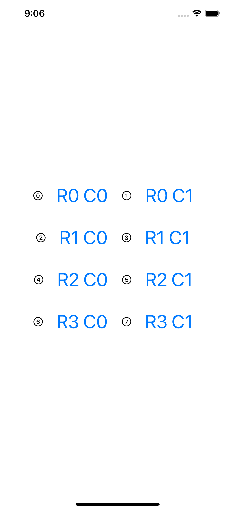

# Project 3 - ViewsAndModifiers

https://www.hackingwithswift.com/100/swiftui/23

## Topics

Views, modifiers, composition, containers

## Challenges

From [Hacking with Swift](https://www.hackingwithswift.com/books/ios-swiftui/views-and-modifiers-wrap-up):
>1. Create a custom ViewModifier (and accompanying View extension) that makes a view have a large, blue font suitable for prominent titles in a view.

## Screenshots

